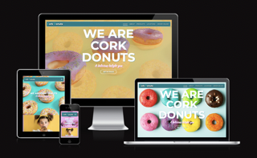
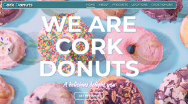
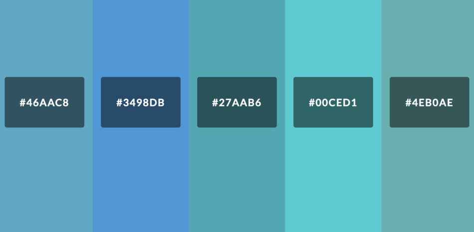
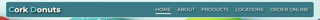
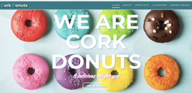
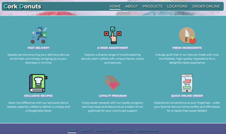
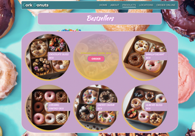
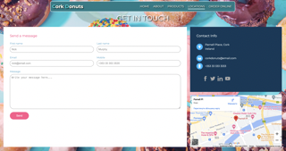
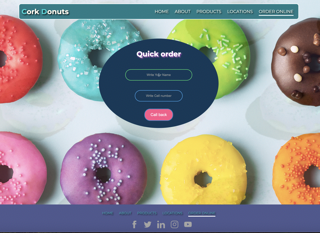

# Tetiana Zasimenko - Cork Donuts

## Donut Ordering Website

This website is a delightful online platform for ordering a variety of mouth-watering donuts.
It is the result of acquired technical knowledge that resonates with the overall mood of the product.

# Table of Contents

  
- [Table of Contents](#table-of-contents)
  - [Demo](#demo)
    - [A live demo to the website can be found he](https://tzasimenko-ua.github.io/cork-donuts/)
  - [UX](#ux)
  - [User stories](#user-stories)
    - [Strategy](#strategy)
    - [Scope](#scope)
    - [Structure](#structure)
    - [Skeleton](#skeleton)
    - [Surface](#surface)
  - [Technologies](#technologies)
  - [Features](#features)
    - [Existing Features](#existing-features)
    - [Features Left to Implement](#features-left-to-implement)
  - [Testing](#testing)
    - [Validator Testing](#validator-testing)
    - [Bugs](#bugs)
  - [Deployment](#deployment)
   [Credits](#credits)
    - [Content](#content)
    - [Media](#media)

## Demo

### A live demo to the website can be found [here](https://tzasimenko-ua.github.io/cork-donuts/)

## UX

This site is aimed at quickly capturing attention and prompting instant ordering. Simplicity and ease of navigation increases the chances of completing an order. The emphasis is on an appetizing look and emphasizing important client needs.

## User stories

Reflecting on the appearance of the site of its sections and the specified information, I proceeded from the following considerations:

- As a potential customer, the goal of this website is to provide a quick and intuitive way to understand how it facilitates the instant ordering of delicious donuts.
- As a user, I expect simplicity and ease of navigation on the website, whether I'm using a mouse, keyboard, or touchscreen.
- As a visitor, it's important for me to explore the variety of offered donuts, discovering unique flavors, colors, and textures.
- As a customer, I want an easy understanding of the order placement process, payment options, and receiving my favorite donuts.
- As a user, I seek access to information about special offers, promotions, and a loyalty program.
- As a customer, I appreciate the ability to quickly contact site representatives if I have questions or specific order requirements.

### Strategy

“See and Crave” is a feature of this site that turns desire into action in a few clicks. Users are introduced to the visually appealing styling and are instantly inspired to enjoy the delightful experience of ordering tempting donuts.

### Scope

For users, the website aims to provide a basic overview of the offerings. Focusing on variety, freshness and uniqueness. Users can easily navigate the menu to explore the tempting options created.

### Structure

I stuck with the traditional online ordering process because it is not too complicated and it will be easy for users to find the information they need. The website has one long scrolling page and three non-scrolling pages. My structure has a fixed top navigation that connects the user to each section from anywhere on the page. I also included a link to the home page in the logo

**Website Sections:**

1. **Homepage:**

   - Banner with a happy child: A positive welcome with an image of a joyful child enjoying delicious donuts.
   - Production Description: Detailed information about our high production standards, emphasizing the important qualities and uniqueness of our products.
   - Call to Action (CTA): "Order Now" button encouraging users to place an order and savor the exquisite taste.

2. **Products Page:**

   - Variety of Products: Showcase a diverse assortment of donuts with exquisite flavors, accompanied by photographs of each item.

3. **Feedback Page:**

   - Feedback Form: A convenient form for customers to leave their questions, suggestions, or feedback.
   - Map and Contacts: An interactive map displaying the store location and essential contact information.

4. **Call Back Order Page:**

   - Call Back Order Form: A simple form for those who prefer to quickly place an order over the phone.

5. **Footer (on all pages):**

   - Contact Information: Links to our social media profiles, store address, and phone numbers.

### Skeleton

The website is designed to be clear and simple. With convenient navigation between pages

**Wireframe**
The wireframe is designed using Balsamiq software.

My wireframe design in the [(pdf format)](./assets/images/readme_assets.md/maket.pdf)

### Surface

I chose a bright and colorful donut animation for the website background for several reasons. Firstly, it creates a fun and appealing atmosphere, perfectly aligning with the theme of a donut ordering site. Secondly, such animation adds creativity and originality to the visual design, making the project stand out among competitors. Finally, this animation symbolizes joy and enjoyment, encouraging visitors to place orders and creating a positive user experience. This choice is not only stylish but also strategically justified to capture attention and provide a pleasant visual perception of the donut ordering website.

_Background image_

_Main color palette_

## Technologies

1. HTML - To create a basic site
2. CSS - To create a nice, standout front-end and to give a great user experience
3. Balsamiq - To create a wireframe

## Functions

### Existing features

* **Navigation bar**
  - The navigation bar is at the top of the page and is fixed at the top. The logo is in the left navigation corner and links to the index.html page.
    *The rest of the navigation links on the site are on the right. Home, Experience, Education, Skills and Contact are linked to different sections of the same page.
  - The font color stands out against the navigation background. The underline effect is used for navigation so the user can know which page they are on.
  - The various navigation sections are under intuitive headings. Users can easily understand what information is contained in different sections.

- **Home**

- The name of manufacture is superimposed on the background animation with a touch of the main colors of the site
- There is a feedback button for quick interaction with the visitor
  

- **About**
  - The "About" section indicates the most important qualities for the client
  - This section uses a small amount of text and clear visualization of the benefits in pictures

- **Products**
  - The “Products” section presents the proposed sets of the main product
    - This section has a photo and a button to request a call back

- **Get in touch**
      - This section contains information about the location of production and contact information
      - A form has been placed for sending messages from visitors
  - Added hints on correct filling to avoid mistakes

- **Order online**
      - This section contains information on placing an order via a call back
      - Added required fields to avoid empty forms.
  - There is a change of colors when moving from one field to another to add interactivity

- **Footer**
  - This section contains links to social networks and identical links to sections of the site as in the site header

[footer_section](./assets/images/readme_assets.md/footer.png)

### Features Left to Implement

* I would like to make the contact form more functional and add a physical confirmation for the visitor to accept an order or send a message
- I would like to add product design functionality to the set
- I would like to add the ability to schedule delivery and return calls
- I would like to improve the site's performance.

## Testing

*I tested the site and it works in different web browsers: Chrome, Firefox and Microsoft Edge, Safari
- On mobile devices, I tested my site on iPhone 10 iPhone 13, iPhone 13 Pro Max with Safari and Chrome browser.
- I checked that the site is responsive and works on different screen sizes using the devtools device toolbar.
*I have verified that the navigation and sections of "Home", "About", "Products", "Get in touch" and "Order online" are readable and easy to understand.
*I have confirmed that the form works: it requires data entry in each field, only accepts emails in the email field, and the submit and reset buttons work.

### Validator Testing

* **HTML**

- **CSS**
  No errors were found when passing through the official [(Jigsaw) validator](./assets/images/readme_assets.md/validator.png)
  
- **Accessibility**
  I confirmed that the colors and fonts chosen are easy to read and accessible by running it through [Lighthouse DevTools](./assets/images/readme_assets.md/validator2.png)

- **Unfixed Bugs**

My responsive design does not work on all devices. I have plans to re-examine this issue in more detail, since my reference point included iPads, laptops and iPhones

## Deployment

* The site was deployed to Git Hub pages using the following steps:
  - In the Github repository, the Stetting tab.
  - Under General, navigate to Code and Automation and select 'Pages'.
  - In the Build and Deployment section for Source, select 'Deploy from a branch' from the drop-down list.
  - For Branch, select 'main' from the drop-down list and Save.
  - On the top of the page, the link to the complete website is provided.
  
  - The deployed site will update automatically upon new commits to the master branch.

- When creating the site, I used GPT chat to check errors.
- Basic code combinations were created using information from [w3schools.com](https://www.w3schools.com/)

- I took some ideas from the [BrainsCloud](https://www.youtube.com/watch?v=ltMSrSis9ww&list=RDQM-eo9oh2chK4&start_radio=1) YouTude video.

### Media

The imge used as a background image is taken from Google images.
The imge for products creating by GPT

